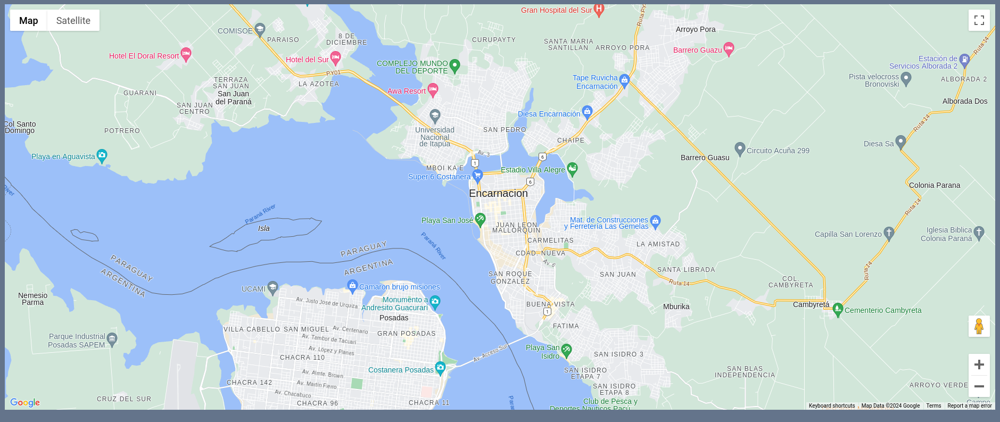
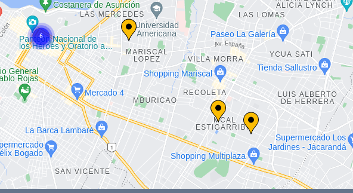
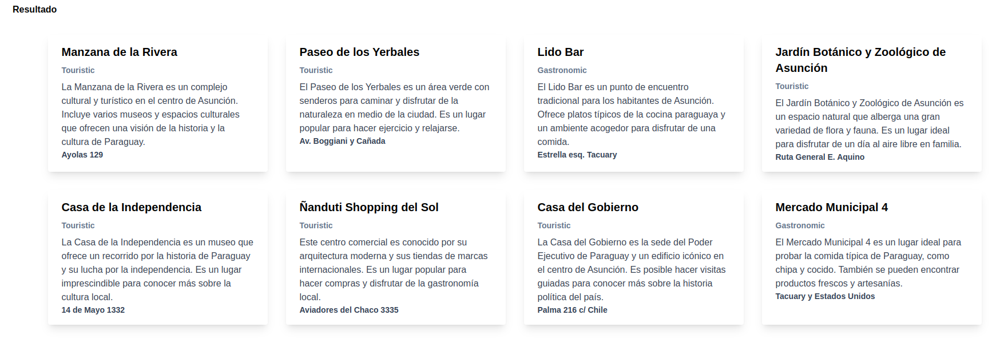

# Desafío Hackathon: Explorador de Lugares con Chatbot

## Introducción:

El desafío de tu equipo es crear un chat bot integrado a un mapa que permita a los usuarios
buscar y visualizar lugares turísticos o de interés, los cuales se deberán visualizar en un mapa.
Utilizarás la API de OpenAI para obtener información sobre estos lugares y se te proporcionará código
para mostrar los resultados en el mapa con marcadores pintados. 
Además, debes implementar un modal que muestre la información de cada lugar en forma de tarjetas.

A continuación proporcionamos una guía detallada para la resolución del desafío:

>Por favor lee la guía completamente antes de empezar con el desafío, de modo que tengas toda la información necesaria
> para completar el desafío de forma satisfactoria.
> 
## Requerimientos funcionales generales:

### Chatbot Integrado con Mapa:
* El usuario debe poder hacer consultas a un chatbot sobre lugares turísticos o de interés.
* El chatbot debe utilizar la API de OpenAI para obtener la información solicitada.
* Las respuestas deben estar en un formato JSON compatible con la librería **vis.gl/react-google-maps.**

### Información de lugares:
Cada equipo debe implementar un componente que contenga tarjetas de información sobre los lugares devueltos por el chatbot. 
La forma de presentar esta información queda a creatividad de cada equipo. Por ejemplo, puede ser un modal general con tarjetas de 
info sobre todos los lugares devueltos. No es necesario construir algo muy complejo, por ejemplo, mostrar modales 
únicos al presionar cada marcador, aunque esto queda a criterio de cada equipo.

### Visualización de Marcadores:
Los usuarios deben poder visualizar los puntos actualizados en el mapa con marcadores pintados. **Esta parte del código será proporcionada. Lo 
explicaremos detalladamente en las siguientes secciones.

## Base de Código:
Se proporciona un proyecto React con una base de código que contiene componentes REACT con lógica del mapa 
y los marcadores, además de las librerías necesarias para su funcionamiento.

También proveeremos las **API Keys** para **Google Maps** y **OpenAI** a través de un archivo **.env**.

## Instrucciones de Instalación y Ejecución:

A continuación, una guía de cómo instalar las librerías con npm y cómo ejecutar el proyecto.

### Configuración del archivo .env:
Se debe crear un archivo **.env** en la raíz del proyecto con las siguientes variables:
```
VITE_GOOGLE_MAPS_API_KEY=google_maps_api_key
VITE_OPENAI_API_KEY=openai_api_key
```

Para acceder a las variables dentro del código se puede utilizar la siguiente sintaxis:
```
import.meta.env.VITE_OPENAI_API_KEY
```
Un ejemplo de esto se puede encontrar en el archivo [Map.jsx](src%2Fcomponents%2FMap.jsx)

### Instalación de las dependencias:
Se debe instalar las dependencias con el siguiente comando:
```
npm install
```

### Ejecución del proyecto:
Para ejecutar el proyecto se puede utilizar el siguiente comando:
```
npm run dev
```
Al ejecutar se despliega una página con un mapa:



El mapa se encuentra centrado a la ciudad de **Encarnación** aunque no está limitado a la misma.

## Instrucciones detalladas y TIPS:

### Estilos CSS:

El proyecto provee las librerías necesarias para utilizar [Tailwind CSS](https://tailwindcss.com). 
Los participantes pueden utilizar los helpers de Tailwind para agregar estilos a los componentes
o pueden crear archivo CSS con sus propios estilos. También se provee un archivo [App.css](src%2FApp.css) al
cual se pueden agregar estilos.

Dejamos los links a la documentación de Tailwind en la sección de [Recursos](#Recursos), en caso de
que se desee utilizarlo.

### Librería de componentes:
El proyecto base provee una librería de componentes REACT que puede ser utilizada por los participantes.
La misma se denomina [headlessui](https://headlessui.com) y ofrece componentes pre-construidos como botones, 
inputs, modales, entre otros.

Esta librería no contiene estilos, por lo tanto, se debe estilizar utilizando Tailwind CSS o estilos CSS.

La documentación se provee en la sección de [Recursos](#Recursos).

Los participantes son libres de usar esta librería, crear sus propios componentes o instalar y utilizar 
alguna librería que conozcan.

### Integración del Chatbot:
El chatbot debe poseer las siguientes características:
- Debe proveer un input donde los usuarios puedan ingresar sus consultas. Puede ser un Textarea o un InputText.
- Debe tener algún mecanismo para enviar la consulta a OpenAI, Puede ser un botón o un evento (por ejemplo al presionar la tecla ENTER sobre el input)
- Debe utilizar la API de OpenAI para procesar las consultas y devolver información en un formato JSON compatible
  con la librería de mapas utilizada. Este formato lo mostramos a continuación:
```
[
    {
        "key": "Nombre del lugar",
        "type": "El tipo del lugar. Catgorias: Turístico, Comida, Desayunos y meriendas, Alojamiento, Tecnología, Compras, Otros",
        "description": "Una descripción con un texto devuelto por 
        el chat-bot explicando por qué el lugar fué incluido en la lista",
        "address": "Dirección del lugar"
        "location": { "lat": xx.xxxxx. Debe ser un valor numérico, "lng": xx.xxxxx. Debe ser un valor numérico }
    },
    ...
]
```

El campo **location** es muy importante, pues debe contener la información de la latitud y longitud para poder pintar los marcadores en el mapa.
Los valores de **lat** y **lng** deben ser **numéricos**, no cadenas de texto.

#### Librería de OpenAI
La librería para realizar consultas a la api de OpenAI ya se encuentra instalada en el proyecto:
A continuación dejamos la guía de como configurarla y otros detalles:

En primer lugar, se debe agregar el apiKey con el valor proporcionado en el archivo.env
```
const configuration = {
    apiKey: import.meta.env.VITE_OPENAI_API_KEY,
    ...
};
```

Para este desafío se harán las consultas a la api de OpenAI desde un Browser, lo cual no es recomendado en
entornos de producción. Por tanto, se debe agregar un parámetro especial a la configuración de la librería:
```
const configuration = {
    apiKey: import.meta.env.VITE_OPENAI_API_KEY,
    dangerouslyAllowBrowser: true
};
```

Luego se debe inicializar la librería con la siguiente sintaxis;

```
import OpenAIApi from 'openai';
...

const configuration = {
    apiKey: import.meta.env.VITE_OPENAI_API_KEY,
    dangerouslyAllowBrowser: true
};

const openai = new OpenAIApi(configuration);
```

Para procesar las consultas debes utilizar la API [Chat completion](https://platform.openai.com/docs/guides/text-generation/chat-completions-api) de OpenAI que se utiliza para [generación de texto de OpenAI](https://platform.openai.com/docs/guides/text-generation).
Esta se puede acceder mediante la librería ya instalada en el proyecto y puedes utilizarla con los siguientes modelos.

* [gpt-3-5-turbo](https://platform.openai.com/docs/models/gpt-3-5-turbo)
* [gpt-4o](https://platform.openai.com/docs/models/gpt-4o)

La documentación de la API se provee además en la sección de [Recursos](#Recursos).

> Es importante que cada equipo se tome un tiempo para leer la documentación. Esto será de gran ayuda para resolver el desafío.

### Diseño del Prompt e integración con el MAPA:

La librería puede recibir un texto con la consulta a la API que consiste en el prompt.

El usuario debe poder ingresar un prompt simple como: `Dame 10 lugares turísticos interesantes en Encarnación` 
o `Muestrame los 10 mejores lugares de tecnología en Encarnmación`. 
Pero esto no devolverá un resultado en el formato necesario para pintar los marcadores en el mapa.

Para lograr esto se debe dar contexto al input del usuario final. Este contexto debe ser ideado
por los participantes y se debe agregar como decorado al texto del usuario en el código
que invoca a la API de OpenAI.

El formato de respuesta a lograr debe ser el siguiente:

```
[
    {
        "key": "Nombre del lugar",
        "type": "El tipo del lugar. Catgorias: Turístico, Comida, Desayunos y meriendas, Alojamiento, Tecnología, Compras, Otros",
        "description": "Una descripción con un texto devuelto por 
        el chat-bot explicando por qué el lugar fué incluido en la lista",
        "address": "Dirección del lugar"
        "location": { "lat": xx.xxxxx. Debe ser un valor numérico, "lng": xx.xxxxx. Debe ser un valor numérico }
    },
    ...
]
```
### Pintado de marcadores:

El campo **location** de cada item, debe contener la información de la latitud y longitud para poder pintar los marcadores en el mapa.
Los valores de **lat** y **lng** deben ser **numéricos**, no cadenas de texto.

Se provee un componente con la lógica del mapa en el archivo [Map.jsx](src%2Fcomponents%2FMap.jsx)

El mismo es un componente REACT que posee un **prop** denominado **locations**. Este **prop** puede recibir una lista 
que debe ser generada procesando la respuesta JSON devuelta por el chat-bot.

Este componente ya se encuentra implementado en el componente principal [App.jsx](src%2FApp.jsx) de la aplicación, con el estado
necesario para su funcionamiento:

```javascript
const App = () => {
  let [places, setPlaces] = useState([]);

  return (
    <>
      <div className="w-screen h-screen m-0 p-3 bg-slate-500">
        <MapComponent locations={places}/>
      </div>
    </>
  );
};
```

Los participantes deben alimentar el estado **places** con una lista generada a partir de la respuesta del chat-bot. 
El resultado, cuando se utiliza el formato correcto, queda de la siguiente manera:



### Tarjetas con información de los lugares:
Cada equipo debe implementar un componente que permita visualizar la información de los lugares encontrados. 

Cada tarjeta debe contener al menos los siguientes datos: 
* **nombre**. El nombre del lugar
* **tipo**. Qué tipo de lugar es, turístico, tecnología, gastronómico, etc.
* **descripción**. Una descripción con un texto devuelto por el chat-bot explicando por qué el lugar fué incluido en la lista.
* **dirección**. La dirección del lugar.


#### Ayudas
Como ejemplo, el componente podría consistir en un modal que se abre con un botón y muestra el listado de los lugares en forma de tarjetas,
pero esto queda abierto a las ideas de cada equipo.

Se proveen algunos componentes de ayuda. Cada equipo es libre de usar estos componentes o crear sus propios componentes con estilos a gusto. 

Para las tarjetas se provee una pequeña ayuda, un componente denominado [Card](src%2Fcomponents%2FCard.jsx) que se puede utilizar para las tarjetas 
de información. El mismo tiene los props **nombre, tipo, direccion y descripcion**. Como utilizarlo en una lista
queda a la creatividad de los participantes.

Un ejemplo de como se podrían ver las tarjetas:


También se provee un componente pre-construido denominado [LoaderModal](src%2Fcomponents%2FLoaderModal.jsx)
que muestra un diálogo con indicador de carga, que funciona como feedback para el usuario final.
El mismo puede ser utilizado a gusto por los participantes para esta sección.
Queda a criterio del participante la decisión de utilizarlo y de cómo utilizarlo.

## Desafío BONUS

Esta parte del desafío no es obligatoria, pero podría dar puntos adicionales al equipo en caso de ser completada.
Para completar esta sección, necesariamente el equipo tuvo que haber completado las anteriores.

### Chatbot con lugares restringidos

En esta sección el equipo debe realizar lo siguiente:

En la carpeta assets se encuentra el siguiente archivo: [lugares.json](src%2Fassets%2Flugares.json). El mismo contiene una lista finita
de lugares.

El equipo debe crear un nuevo componente de Chatbot que reciba en el prompt de contexto la lista de lugares
del archivo, como JSON. En otras palabras, se debe modificar el prompt de contexto para que la api tome estos lugares como base de datos 
donde buscar.

El equipo debe generar un nuevo componente de chatbot para implementar esta funcionalidad. Se puede duplicar el componente existente, colocarle un
nombre diferente y hacer las modificaciones correspondientes. Ejemplo, si el componente que contiene el chatbot normal se llama 'Chatbot'
se puede duplicar y llamarlo 'BonusChatbot'.

## Flujo de trabajo

La rama base a ser utilizada será **develop**. Por tanto, los participantes deben descargar esta rama.

Luego, se debe generar una rama para el equipo con el siguiente formato:

`feature/nombre-equipo`

Para trabajar con los cambios, recomendamos dividir el trabajo y que cada participante cree una **rama local** a partir de la rama **develop** con la siguiente nomenclatura y formato: 

`feature/nombre-participante`

Al finalizar, cada participante puede subir los cambios y un líder de equipo puede encargarse de mezclar los
cambios de las ramas individuales a la rama del equipo `feature/nombre-equipo`.

Para subir el resultado final, se debe crear un **Pull Request** a la rama **develop**, con los cambios de la **rama del equipo**, de forma que los supervisores
puedan revisarlo.


## Criterios de Evaluación:

* **Funcionalidad**: La aplicación debe cumplir con todos los requerimientos especificados.
* **Diseño de prompt**: Será analizado el contexto dado al prompt para la resolución del desafío.
* **Creatividad**: Soluciones creativas y únicas serán valoradas.
* **Interfaz de Usuario (UI/UX)**: La interfaz debe ser intuitiva(usabilidad) y atractiva.
* **Calidad del Código:** Buena estructura, legibilidad y uso adecuado de las mejores prácticas de desarrollo.
* **Utilización de React:** Utilización de hooks y componentes.
* **Utilización de GIT:** Creación de ramas y generación de Pull Request.

## TIPS

>Utiliza características de ES6 para acelerar tu desarrollo. Por ejemplo,
>[template literals](https://developer.mozilla.org/en-US/docs/Web/JavaScript/Reference/Template_literals) o
>[async/await](https://developer.mozilla.org/es/docs/Web/JavaScript/Reference/Statements/async_function).

>El diseño de los prompts es fundamental para obtener los resultados deseados del chat-bot. Ten presente esto durante 
>el desarrollo del desafío.

>Organiza el trabajo en el grupo, asignando tareas específicas para cada integrante. También recuerda que 
> DOS cabezas piensan mejor que UNA :)

>Utiliza los buscadores de las documentaciones con palabras claves de acuerdo a lo que necesites.

>Divide y vencerás. Piensa de forma modular. Crea componentes específicos para cosas específicas.

# Recursos:

### OpenAI
* [API de OpenAI](https://platform.openai.com/docs/overview)
* [API Chat Completion](https://platform.openai.com/docs/guides/text-generation/chat-completions-api)

### React
* [Documentación de REACT](https://react.dev/reference/react)

### Tailwind CSS
* [Documentación de tailwind CSS](https://tailwindcss.com/docs)

### Headless UI
* [Documentación de Headless UI](https://headlessui.com)

### GITHUB
* [Documentación de GITHUB](https://docs.github.com/en)

## ¡Buena suerte y disfruta del desafío! :sunglasses: